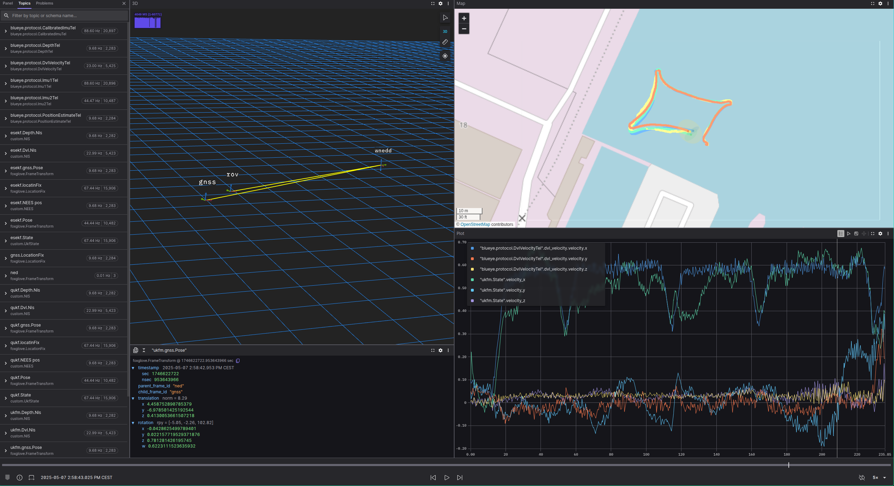

#  Development of a 6-DOF Observer for a Remotely Operated Underwater Vehicle

This repository suplements the thesis by Håvard Syslak and contains code for:

- Implementations of three version of nonlinear Kalman filters:
    - Uncented Kalman Filter on Manifolds 
    - Error State Extende Kalman filter
    - Quaternion Uncented kalman filter
- Data logging from the Blueye X3 using the Blueye SDK
- Logging and streaming Foxglove Studio for live visualization

